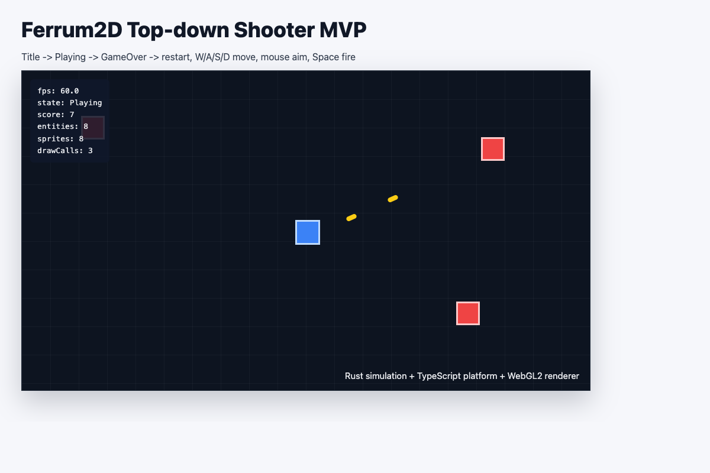

# Ferrum2D

Ferrum2D는 Rust core, WebAssembly, TypeScript 플랫폼 레이어, WebGL2 기본 렌더러, 선택 WebGPU 렌더러로 구성한 2D 웹 게임 엔진이다.

현재 package version은 `0.1.0`이지만, 기능 상태는 **MVP 개발 완료, 상용제품 기능 개발** 단계다. `examples/starter-runtime`은 제품용 starter runtime 흐름을 보여주고, `examples/topdown-shooter`, `examples/breakout`, `examples/platformer`, `examples/physics-sandbox`는 같은 runtime/API가 여러 장르와 물리 authoring 흐름에서 동작하는지 검증한다.

Ferrum2D의 제품 목표는 기존 게임 엔진처럼 비주얼 에디터를 중심에 두는 것이 아니라, AI agent가 Game Spec, Physics Spec, 프로젝트 템플릿, 검증 스크립트를 사용해 게임을 생성하고 수정하는 **AI agent-first 2D game engine**을 만드는 것이다.

## 엔진 철학

Ferrum2D는 **AI agent가 안전하게 게임을 만들고, 사람이 검증 가능한 방식으로 확장하는 작고 빠른 2D runtime engine**을 지향한다.

앞으로 기능을 고도화할 때는 다음 원칙을 유지한다.

- **Agent-first, editor-second**: 기본 개발 흐름은 visual editor가 아니라 Game Spec, Physics Spec, template, skill, subagent, smoke, replay 기반이다. Visual editor는 필요할 때 별도 승인된 보조 도구로만 검토한다.
- **Public API first**: consumer game은 `@ferrum2d/ferrum-web` public entrypoint만 사용한다. `dist/*`, `pkg/*`, `src/*` 내부 import가 필요하면 엔진 public API가 부족하다는 신호로 보고 API 승격을 검토한다.
- **Data-driven gameplay**: 무기, 발사체, 적, 밸런스, 씬, prefab, physics metadata는 가능한 한 코드보다 spec/authoring data로 표현한다. 코드 변경은 spec과 public runtime primitive로 표현하기 어려운 경우에 제한한다.
- **Performance budget by default**: 1000개 이상 객체를 전제로 설계한다. frame loop에서 entity별 JS/Wasm 왕복 호출, DOM 조작, 문자열/object hot-path 전달을 피하고 bulk buffer와 저빈도 adapter를 우선한다.
- **Rust core / TypeScript platform 경계 유지**: Rust/Wasm은 simulation, entity, collision, render command 생성을 담당하고, TypeScript는 browser API, canvas, input, audio, asset loading, renderer 연결을 담당한다.
- **Deterministic and verifiable**: “화면에서 되는 것 같다”보다 validation report, replay hash, smoke check, runtime budget으로 변경 결과를 증명한다. 새 기능은 가능하면 검증 스크립트와 함께 추가한다.
- **Demo는 제품 검증장**: demo에서 반복되는 요구는 예제 하드코딩으로 키우기보다 public API, authoring primitive, template contract로 승격할지 판단한다. demo 전용 편의 코드는 엔진 내부를 오염시키지 않는다.
- **작은 primitive 조합**: 특정 장르 전용 엔진이 아니라 projectile, behavior recipe, scene composition, input binding, asset pipeline, replay 같은 작은 범용 primitive를 제공하고 게임은 이를 조합한다.

기능 추가 여부는 “이 변경이 AI가 안전하게 수정할 수 있는 public/data/replay 기반 기능인가, 아니면 특정 demo를 빨리 만들기 위한 임시 하드코딩인가?”를 기준으로 판단한다. 전자는 엔진 고도화 후보이고, 후자는 예제 코드로 격리한다.



위 이미지는 Top-down Shooter 화면 구성을 보여주는 릴리스 preview다. 실제 브라우저 캡처를 갱신할 때는 [docs/development/quality/screenshots/README.md](docs/development/quality/screenshots/README.md)를 따른다.

## 구현된 기능

세부 API 계약은 [Public API](docs/engine/public-api.md), 물리 범위는 [2D 물리엔진 기능 맵](docs/development/architecture/physics-engine.md), Shooter authoring 계약은 [Top-down Shooter Game Spec](docs/examples/topdown-shooter/game-spec.md)을 기준으로 한다.

### Runtime / Wasm

| 기능 | 짧은 설명 |
| --- | --- |
| Rust core update loop | 게임 상태와 물리, 씬 로직을 Rust에서 갱신한다. |
| Wasm bridge | Rust buffer와 TypeScript renderer/audio/input을 연결한다. |
| `createEngine(...)` | Wasm engine과 frame callback을 묶는 낮은 수준 실행 API다. |
| `createFerrumRuntime(...)` | canvas, renderer, input, audio, UI를 한 번에 만드는 브라우저 runtime이다. |
| Frame pipeline | 입력 전달, Rust update, buffer read, audio drain, render를 순서대로 처리한다. |
| `FrameState` | 한 frame의 점수, 카메라, sprite, audio, physics debug, action diagnostic 정보를 담는다. |
| Bulk buffer ABI | render/audio/gameplay/collision/physics/frame telemetry 데이터를 숫자 buffer로 한 번에 넘긴다. |
| Game state snapshot | 세이브용 JSON snapshot을 캡처, 복원, 저장, 해시 검증한다. |
| Runtime profiler | frame/render/Rust update/asset load budget을 샘플링한다. |
| Diagnostic report | runtime과 package 상태를 사람이 읽기 쉬운 report로 만든다. |

### Rendering / Visual

| 기능 | 짧은 설명 |
| --- | --- |
| WebGL2 renderer | 기본 2D sprite renderer다. |
| WebGPU renderer | 지원 환경에서 선택 사용하고 실패하면 WebGL2로 fallback한다. |
| Render command buffer | Rust가 sprite draw command를 만들고 TS가 GPU로 그린다. |
| Viewport render culling | 화면 밖 tile, sprite, particle command 생성을 줄인다. |
| Camera preset | follow, dead-zone, look-ahead, shake 카메라를 Game Spec으로 설정한다. |
| Camera rig | `CameraRigController`로 dead-zone, bounds, optional smoothing 기반 camera center를 계산한다. |
| Sprite batching | 같은 texture/material draw를 묶어 draw call을 줄인다. |
| Sprite material preset | `unlit`, `flash`, `additive`, `outline` 같은 전체 sprite pass 효과를 적용한다. |
| HD-2D render sort | floor, elevation, footY, render layer로 sprite command 정렬을 안정화한다. |
| Texture manager/registry | texture asset을 id/name으로 관리한다. |
| Tilemap renderer | static/dynamic tile layer를 render command로 그린다. |
| Particle system | Rust particle simulation과 burst render command를 제공한다. |
| VFX preset/emitter | hit spark, dust loop, motion trail 같은 low-frequency VFX helper다. |
| Lighting pass | ambient, point light, tile occluder shadow를 platform renderer에서 처리한다. |
| HD-2D lighting occluder helper | tile `blocksVision`과 `occluderHeight`를 lighting shadow occluder로 바꾼다. |
| Post-processing | WebGL2 fade/bloom/CRT/vignette/glitch fullscreen pass를 지원한다. |
| WebGPU fade pass | WebGPU 경로에서 fade post-process를 지원한다. |
| Screen fade transition | `ScreenFadeTransition`으로 시간 기반 fade-in/out state와 post-process pass를 만든다. |
| PixelMaskTerrain texture upload | 파괴 가능한 alpha mask texture와 dirty patch upload를 지원한다. |
| Screenshot summary | smoke test용 canvas pixel summary와 baseline 비교를 만든다. |

### Input / Audio / Assets

| 기능 | 짧은 설명 |
| --- | --- |
| InputManager | keyboard, mouse, pointer, touch, gamepad 입력을 snapshot으로 합친다. |
| Action profile | raw input을 `move`, `fire`, `jump` 같은 게임 action으로 바꾼다. |
| Virtual controls | 모바일용 joystick/button DOM control을 제공한다. |
| AssetLoader | texture, sound, JSON asset을 로드한다. |
| Asset preload plan | loading screen용 manifest, progress, cache version을 만든다. |
| IndexedDB asset cache | opt-in JSON/binary body cache로 반복 fetch를 줄인다. |
| LoadingOverlay | asset load progress를 DOM UI로 표시한다. |
| Texture atlas packer | PNG sprite를 atlas 이미지와 `game.json` frame metadata로 묶는다. |
| Atlas metadata helper | sprite name/size/source 목록을 deterministic atlas JSON으로 변환한다. |
| Aseprite importer | Aseprite JSON frame metadata를 Game Spec atlas frame으로 바꾼다. |
| Tiled importer | Tiled orthogonal map을 atlas/tilemap 설정으로 바꾼다. |
| LDtk importer | LDtk project/level/tile/entity metadata를 Game Spec으로 바꾼다. |
| Tile rules/animated tiles | neighbor rule과 animated tile frame을 baked layer data로 만든다. |
| Level streaming helper | 큰 tilemap chunk의 active/preload/retain/load/unload plan을 계산한다. |
| AudioManager | Web Audio 기반으로 BGM, SFX, UI sound를 재생한다. |
| Audio bus volume | master/bgm/sfx/ui gain을 따로 조절한다. |
| BGM fade | BGM loop, fade-in, fade-out을 지원한다. |
| Rust audio event channel | Rust audio event를 BGM/SFX/UI bus로 라우팅한다. |

### Authoring / Gameplay Data

| 기능 | 짧은 설명 |
| --- | --- |
| Shooter Game Spec | Top-down Shooter를 JSON으로 설정한다. |
| Physics Spec | rigid body, collider, joint, material, layer를 JSON으로 정의한다. |
| Physics HD-2D authoring | `physics.hd2d`, body floor/elevation/height, tile HD-2D metadata를 검증하고 runtime에 적용한다. |
| Physics authoring compiler | tooling metadata를 제거하고 runtime Physics Spec만 추출한다. |
| Scene composition | prefab, variant, reusable fragment를 flat instance로 만든다. |
| Behavior recipe | health, damage, pickup, chase 같은 흔한 행동을 command로 변환한다. |
| Animation timeline | sprite frame, event, state transition을 데이터로 재생한다. |
| Cutscene sequence | wait/camera/audio/dialogue command timeline을 실행한다. |
| HUD toolkit | meter, counter, prompt, message를 `UiOverlayState`로 만든다. |
| Localization helper | locale fallback, placeholder, 짧은 UI text layout을 처리한다. |
| Dialogue session | 대화 node, choice, flag 진행을 관리한다. |
| Quest log | quest, stage, objective 진행 상태를 관리한다. |
| Accessibility helper | reduced motion, subtitle, contrast palette, input assist를 정규화한다. |
| Debug gizmo helper | path, spawn, prefab, collider authoring data를 debug line으로 만든다. |

### Physics / Collision

| 기능 | 짧은 설명 |
| --- | --- |
| World/entity storage | entity id, generation, component storage를 Rust가 관리한다. |
| Transform/velocity/sprite components | 기본 2D 이동과 렌더링 데이터를 저장한다. |
| AABB collision | 기본 arcade collision과 overlap 판정을 제공한다. |
| Collider shapes | AABB, circle, capsule, oriented box, convex polygon, edge, chain을 지원한다. |
| Compound colliders | 한 rigid body에 여러 collider를 붙일 수 있다. |
| Layer/filter/mask | collision category와 mask로 충돌 대상을 제한한다. |
| HD-2D height span | floor/elevation/height로 서로 다른 층의 body 충돌을 분리한다. |
| HD-2D query filter | body/tile query, raycast, shape-cast, contact/manifold에 optional `heightSpan` filter를 적용한다. |
| HD-2D runtime metadata API | body height span과 tile height/kind/ramp/bridge metadata를 낮은 빈도 API로 바꾼다. |
| HD-2D tile metadata | tile kind/ramp/blocking metadata를 Game Spec, Tiled/LDtk importer, runtime API로 설정한다. |
| HD-2D kinematic move | height span 기반 이동, 단차, ramp 보간, ledge drop, bridge under-pass를 처리한다. |
| HD-2D bridge navigation | `bridgePortal`과 `toHeightSpan`으로 위/아래 floor path를 계산한다. |
| HD-2D projectile combat | projectile arc, bullet height span, `blocksProjectile` tile filter를 처리한다. |
| HD-2D snapshot/telemetry | height span snapshot sidecar와 player/filter debug 지표를 제공한다. |
| Contact/manifold | 충돌 normal, penetration, contact point를 계산한다. |
| Point/area query | point, AABB, circle, capsule, oriented box, polygon query를 제공한다. |
| Ray/segment/shape cast | raycast, segment cast, shape cast로 이동 경로 충돌을 찾는다. |
| Tilemap collision cache | solid tile rect를 chunk cache로 묶어 query 범위를 줄인다. |
| Slope/one-way tile | platformer용 slope와 one-way platform을 지원한다. |
| Tile obstacle queries | tile nearest/raycast/swept/contact/manifold query를 제공한다. |
| Kinematic controller | top-down/platformer 이동, slide, ground probe, step offset을 처리한다. |
| Rigid body solver | dynamic/static/kinematic body의 힘, 충격량, 위치 보정을 계산한다. |
| Fixed timestep | 안정적인 물리 step과 interpolation alpha를 제공한다. |
| CCD | 빠른 rigid body의 tunneling을 줄인다. |
| Sleeping/islands | 쉬는 rigid body와 island schedule로 solver 비용을 줄인다. |
| Joints | distance, rope, spring, pulley, revolute, prismatic, weld, gear joint를 지원한다. |
| Vehicle rig helper | prismatic guide와 spring suspension으로 간단한 차량 rig를 만든다. |
| Material/tuning | friction, restitution, density, damping 같은 물리 값을 설정한다. |
| Physics debug lines | broadphase, contacts, manifolds, colliders, joints, sleeping, layers, CCD를 선으로 표시한다. |
| Collision lifecycle events | enter/stay/exit/hit/trigger event를 opt-in으로 추적한다. |
| Body state buffer | rigid body 상태를 typed array로 bulk snapshot/restore한다. |
| Physics snapshot/replay | Physics Spec world를 캡처, 복원, replay hash로 검증한다. |
| Replay Worker client | replay 검증을 opt-in Web Worker에서 실행한다. |
| PixelMaskTerrain collision | alpha mask terrain을 collision tilemap/chain boundary로 변환한다. |

### Tilemap / Scenes / Packaging

| 기능 | 짧은 설명 |
| --- | --- |
| Tilemap authoring API | tile definition, layer, tile edit, rect edit을 제공한다. |
| Dirty chunk rebuild | 변경된 collision chunk만 다시 만든다. |
| Tile navigation | collision layer 기반 A* waypoint/path query와 HD-2D multi-floor path를 제공한다. |
| Boundary chain export | tilemap collision layer를 Physics Spec chain body로 바꾼다. |
| Starter Runtime | 가장 작은 `createFerrumRuntime(...)` 사용 예제다. |
| Top-down Shooter | Game Spec, combat, enemy wave, audio/VFX, tilemap을 검증하는 예제다. |
| Breakout | rigid/contact와 간단한 장르 scene 전환을 검증하는 예제다. |
| Platformer | platformer controller, slope, jump, ground state를 검증하는 예제다. |
| Physics Sandbox | Physics Spec authoring/debug 흐름을 검증하는 예제다. |
| `@ferrum2d/ferrum-web` | 브라우저 게임 runtime npm package다. |
| `@ferrum2d/create-game` | 새 Ferrum2D 게임 프로젝트 생성 CLI다. |
| `@ferrum2d/agents` | consumer game 개발용 agent/skill/command 설치 CLI다. |
| Package QA scripts | tarball, exports, Wasm artifact, consumer import를 검증한다. |
| Pages build scripts | demo/docs GitHub Pages artifact를 생성한다. |
| Smoke checks | headless/browser/spec/package/release 검증 스크립트를 제공한다. |

## 현재 제품 범위에서 하지 않는 것

- 3D 렌더링
- 전체 게임 루프의 Web Worker 이전
- Wasm threads / SharedArrayBuffer 기본 빌드
- Full visual editor 중심 개발 방식
- 멀티플레이어
- user scripting/plugin runtime
- skeletal animation
- soft body, cloth, fluid 같은 complex physics core 확장
- spatial audio와 복잡한 mixer automation

일부 제외 항목의 이전 public API 이름은 마이그레이션 리스크를 줄이기 위한 deprecated compatibility shim으로만 남아 있을 수 있다. 이 shim은 제품 런타임 기능을 제공하지 않으며, 기본 실행 경로는 WebGL2/WebGPU renderer, requestAnimationFrame, SFX, 직접 asset loading으로 제한한다.

## npm 패키지 구성

Ferrum2D npm 배포 단위는 역할별로 분리한다.

| package | 역할 |
| --- | --- |
| `@ferrum2d/ferrum-web` | 게임 실행에 필요한 엔진 런타임 본체 |
| `@ferrum2d/create-game` | 새 Ferrum2D 게임 프로젝트 생성 CLI |
| `@ferrum2d/agents` | AI로 Ferrum2D 게임을 개발할 때 사용하는 consumer agent/skill/command 설치 CLI. Agent Template Showcase 기준은 [packages/agents/README.md](packages/agents/README.md#agent-template-showcase)다. |

새 게임 프로젝트는 다음 흐름으로 만든다.

```bash
npm create @ferrum2d/game my-game
cd my-game
npm install
npm run dev
```

AI agent/skill은 명시적으로 설치한다. `npm install @ferrum2d/ferrum-web`만으로 사용자 프로젝트의 `.agents`, `.codex`, `.claude`, `.gemini` 파일을 변경하지 않는다.

```bash
npx @ferrum2d/agents init --tools codex,claude,gemini
```

## 개발환경 설정

Ferrum2D는 Rust/Wasm core와 TypeScript web package를 함께 빌드한다. Rust toolchain, Wasm target, wasm-pack, Node.js, pnpm이 모두 필요하다.

Rust stable과 Wasm target을 준비한다.

```bash
rustup default stable
rustup target add wasm32-unknown-unknown
```

Wasm package 생성에는 `wasm-pack`이 필요하다.

```bash
cargo install wasm-pack
wasm-pack --version
```

Node.js는 22 버전을 권장한다. Corepack으로 pnpm 10.8.0을 활성화한다.

```bash
node --version
corepack enable
corepack prepare pnpm@10.8.0 --activate
pnpm --version
```

저장소 루트에서 workspace 의존성을 설치한다.

```bash
pnpm install
```

설정이 끝나면 기본 검증을 실행한다.

```bash
pnpm test
pnpm build
```

`pnpm build`가 `wasm32-unknown-unknown target not found`로 실패하면 PATH에서 rustup Rust가 아닌 다른 Rust가 먼저 잡힌 상태일 수 있다. 이 경우 `which rustc`, `rustup which rustc`, `rustup target list --installed`를 확인한다.

## 예제 실행

최소 starter 예제는 별도 asset 없이 engine loop와 WebGL2 render path를 확인한다.

```bash
pnpm dev:starter-runtime
```

장르 검증 예제는 같은 runtime/API 위에서 실행된다.

```bash
pnpm dev:breakout
pnpm dev:platformer
```

Physics Spec 기반 generic rigid body sandbox는 다음으로 실행한다.

```bash
pnpm dev:physics-sandbox
```

Top-down Shooter 예제는 Rust core를 수정했거나 처음 실행하는 경우 Wasm package를 먼저 만든다.

```bash
pnpm build:wasm
pnpm --filter @ferrum2d/topdown-shooter dev
```

기본 Vite URL은 다음과 같다.

```text
http://localhost:5173
```

DebugOverlay를 숨기려면 URL에 `?debug=false`를 붙인다.

```text
http://localhost:5173?debug=false
```

## 조작법

- `Enter` 또는 `Space`: Title에서 게임 시작
- `W/A/S/D`: 플레이어 이동
- `Mouse Left` 또는 `Space`: 마우스 방향으로 발사
- `Space`: GameOver에서 재시작

## 빌드와 검증

전체 빌드:

```bash
pnpm build
```

Rust 테스트:

```bash
cargo test --manifest-path crates/ferrum-core/Cargo.toml
```

TypeScript 테스트:

```bash
pnpm test:web
```

전체 테스트:

```bash
pnpm test
```

Game Spec 검증과 smoke check:

```bash
pnpm validate:game-spec
pnpm smoke:headless
pnpm smoke:check
```

패키지와 릴리스 후보 검증:

```bash
pnpm package:check
pnpm package:consumer-smoke
pnpm release:check
```

실제 publish 후보 전환 전 전체 release gate는 `docs/development/operations/npm-release.md`를 기준으로 한다.

GitHub Pages demo/docs artifact 생성:

```bash
pnpm build
pnpm build:pages
```

상용제품 기능 개발 기본 검증:

```bash
cargo test --manifest-path crates/ferrum-core/Cargo.toml
pnpm lint
pnpm test
pnpm validate:game-spec
pnpm smoke:headless
pnpm package:check
pnpm package:consumer-smoke
pnpm release:check
pnpm build
```

수동 smoke check 기준은 [Top-down Shooter 체크리스트](docs/development/quality/topdown-shooter-smoke-checklist.md)와 [Smoke Check 문서](docs/development/quality/smoke-check.md)를 따른다.

## 프로젝트 구조

```text
crates/ferrum-core/          Rust core, scenes, game state, collision/physics, render/audio command
packages/ferrum-web/        TypeScript platform layer, WasmBridge, WebGL2/WebGPU renderer
packages/create-game/       npm create용 게임 프로젝트 생성 CLI
packages/agents/            consumer game development용 AI agent/skill 설치 CLI
examples/shared/            예제 공통 demo shell, metric panel, smoke hook
examples/starter-runtime/   createFerrumRuntime starter 예제
examples/minimal-game/      Minimal Runtime Lab; visual-runtime-lab/input-ui-lab smoke fixture
examples/breakout/          Breakout 장르 검증 예제
examples/platformer/        Platformer controller 검증 예제
examples/topdown-shooter/   Top-down Shooter 검증 예제
examples/physics-sandbox/   Physics Spec authoring/debug 검증 예제
docs/                       engine 설명과 development 기준 문서
scripts/                    저장소 보조 스크립트
```

## 상세 문서

- [문서 지도](docs/README.md)
- Engine: [사용자 설명서](docs/engine/user-guide.md), [Public API](docs/engine/public-api.md), [Physics Spec](docs/engine/physics-spec.md)
- Examples: [Top-down Shooter Game Spec](docs/examples/topdown-shooter/game-spec.md)
- Development Architecture: [아키텍처](docs/development/architecture/architecture.md), [2D 물리엔진 기능 맵](docs/development/architecture/physics-engine.md)
- Development Quality: [코드 리뷰 기준](docs/development/quality/code-review.md), [Smoke Check](docs/development/quality/smoke-check.md)
- Development Operations: [GitHub Pages 배포](docs/development/operations/demo-deploy.md), [npm 베타 패키징](docs/development/operations/npm-release.md), [릴리스 노트 템플릿](docs/development/operations/release-notes-template.md)
- [변경 기록](CHANGELOG.md)

## GitHub Actions

현재 CI는 `main` push와 `main` 대상 pull request에서 Rust stable, wasm target, wasm-pack, Node.js 22, pnpm 10.8.0을 준비한 뒤 다음을 실행한다.

- `pnpm install`
- `cargo test --manifest-path crates/ferrum-core/Cargo.toml`
- `pnpm smoke:physics`
- `pnpm smoke:runtime-budgets`
- `pnpm smoke:mass-objects`
- `pnpm smoke:topdown-mass-objects`
- `wasm-pack build crates/ferrum-core --target web --out-dir ../../packages/ferrum-web/pkg`
- `pnpm lint`
- `pnpm test`
- `pnpm build`
- `pnpm package:check`
- `pnpm validate:gameplay-authoring:report`
- `pnpm smoke:gameplay-replay:report`
- `pnpm validate:gameplay-report-artifacts`
- `pnpm smoke:consumer-smoke-report`
- `pnpm smoke:asset-pipeline`
- `pnpm smoke:create-game-template-catalog`
- `pnpm smoke:create-game-template-reports`
- `pnpm smoke:topdown-template-replay-report`

`ferrum-web-v*` tag push에서는 일반 `pnpm package:check` 대신 publish 후보용 `pnpm package:publish-check:ferrum-web`을 실행한다. `ferrum-web-v*` tag push 또는 수동 `consumer_smoke` opt-in에서는 `pnpm package:consumer-smoke -- --artifact-dir artifacts/consumer-smoke`와 `pnpm validate:consumer-smoke-report`도 실행한다. 로컬 릴리스 후보 검증에서는 CI 명령에 더해 `pnpm validate:game-spec`와 브라우저 수동 smoke check를 함께 실행하는 것을 권장한다. 실제 npm publish는 `private: true` 해제와 npm 권한 확인이 승인된 뒤 별도로 수행한다.

## License

Ferrum2D는 `MIT OR Apache-2.0` 듀얼 라이선스로 배포한다. 자세한 내용은 [LICENSE](LICENSE)를 확인한다.
